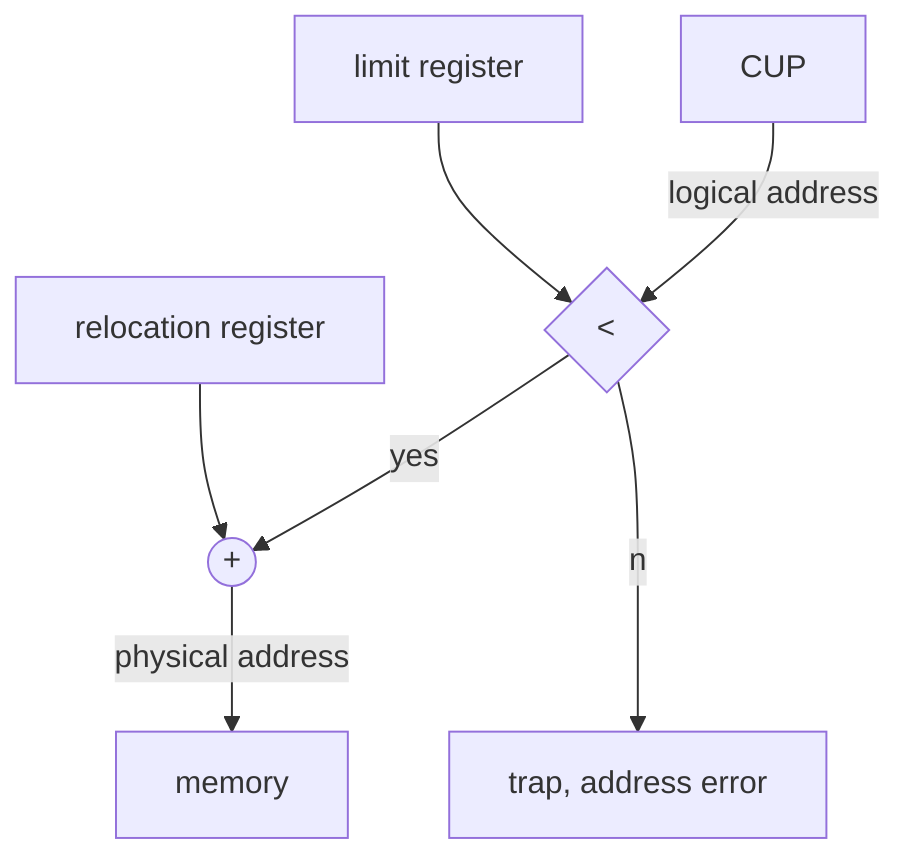

<!-- vim-markdown-toc GFM -->

* [死锁问题](#死锁问题)
  * [概念](#概念)
  * [死锁的必要条件](#死锁的必要条件)
  * [资源分配图](#资源分配图)
  * [死锁的处理](#死锁的处理)
    * [鸵鸟策略](#鸵鸟策略)
    * [预防](#预防)
    * [避免](#避免)
    * [检测和解除](#检测和解除)
    * [银行家算法](#银行家算法)
* [Memory Manage](#memory-manage)
  * [Background](#background)
  * [Binding of Instructions and Data to Memory](#binding-of-instructions-and-data-to-memory)
  * [Logical and Physical Address Space](#logical-and-physical-address-space)
    * [Address Relocation](#address-relocation)
  * [Memory-Management Unit (MMU)](#memory-management-unit-mmu)
  * [Contiguous Allocation](#contiguous-allocation)
    * [Fixed Partitioning Allocation](#fixed-partitioning-allocation)
    * [Dynamic Storage Allocation](#dynamic-storage-allocation)
      * [First-Fit](#first-fit)
      * [Best-Fit](#best-fit)
      * [Fragmentation Problem of Variable Partition](#fragmentation-problem-of-variable-partition)
  * [Paging](#paging)
    * [The Train of Thought](#the-train-of-thought)
    * [Address Translation Scheme](#address-translation-scheme)
    * [Implementation of Page Table and TLB](#implementation-of-page-table-and-tlb)
    * [Effective Access Time](#effective-access-time)
    * [Address Transformation Mechanism and Process](#address-transformation-mechanism-and-process)

<!-- vim-markdown-toc -->

# 死锁问题

## 概念

计算机操作系统中多道程序并发执行时，两个或者两个以上的进程由于竞争资源而造成的一种互斥现象。如果无外力作用，这些进程将永远不能向前进行。

一组等待的进程，其中每一进程都持有资源，并且等待着由这个组中其他进程所持有的资源。

**死锁的原因**

- 竞争资源引起死锁
- 进程推进顺序不当引起死锁

## 死锁的必要条件

- **互斥**：一次只有一个进程可以使用一个资源。
- **占用并等待**：一个至少持有一个资源的进程等待获取额外的由其他进程所持有的资源（请求与保持）
- **不可抢占**：一个资源只有当持有它的进程完成任务后才被释放。（非剥夺）
- **循环等待**：等待资源的进程之间存在环。  

## 资源分配图

圆圈表示进程，方形表示一类资源，方形里面的小正方形或者小圆圈表示某类资源的实例。

- 如果没有环，那么不会有死锁。
- 如果图有环
  + 如果每一种资源只有一个实例，那么死锁发生。
  + 如果每种资源类型有多个实例，可能死锁。

## 死锁的处理

### 鸵鸟策略

直接忽略死锁。

### 预防

抑制死锁发生的必要条件。

- 互斥无法被打破：并非所有的资源都是共享的，有些资源必须得互斥。
- 打破占有并等待：保证进程申请资源的时候没有占有其他资源。
  + 方案一：要求进程在执行前一次性申请全部的资源。
  + 方案二：没有资源时，可以申请资源。在申请更多其他资源之前，需释放已有资源。
  + 缺点：利用率低，可能出现饥饿。
- 打破非抢占
  + 如果一个进程资源的申请没有实现，它要释放所有占有的资源。
  + 抢占的资源放入进程等待资源列表中。
  + 只有进程能够重新得到旧的资源和新申请的资源时，才可以重新开始。
- 打破循环等待
  + 策略：所有进程对资源的请求必须严格按资源序号递增的次序提出。
  + 效果：这样一来，总有一个进程占据了较高序号的资源，它继续请求的资源必然是空闲的，可以一直向前推进。在资源分配图中也不可能出现环路，因而打破了“环路等待”条件。
  + 优缺点：这种策略可以提高资源利用率，但在进程使用各类资源的顺序与系统规定的顺序不同时会出现资源浪费的情况。

### 避免

允许进程动态地申请资源，系统在进行资源分配之前，先计算资源分配的安全性。如果此次分配不会导致系统从安全状态转换到不安全状态，则可以分配，否则不分配。

### 检测和解除


### 银行家算法

条件

- 多个实例
- 每一个进程必须事先声明使用的最大量
- 当一个进程请求资源，它可能要等待
- 当一个进程得到所有的资源，它必须在有限的时间内释放它们

定义变量：
- 进程数目n
- 资源类型数目m
- 资源Rj的有效实例数 avaliable[j]
- 进程Pi需要的Rj实例的最大数目max[i,j]
- 进程Pi已经申请到的Rj的实例数目 allocation[i,j]
- 进程Pi还需要的资源Rj的实例数目 need[i,j]

则 need[i,j] = max[i,j] - allocation[i,j]

1. 请求的不能比目前需要的还多
2. 请求的不能比系统当前能给予的还多
3. 更新资源数目
4. 安全检测，不安全则不分配，并恢复资源数目


**安全检测算法**

随便找一个当前资源够跑的进程，让它跑完，这样就能释放掉他的所有资源，然后做个标记，再去找下一个，直到所有的进程都被标记，说明系统处于安全状态。如果在进程没标记完的情况下就找不到能跑的进程了，说明不是安全状态。


# Memory Manage

## Background

**Memory hierarchy**

$$
register \Longrightarrow cache \Longrightarrow primary\ storage \Longrightarrow secondary\ storage
$$

**Some facts**
1. Program must be brought into memory and placed within a process for it to be excuted.
2. Input queue - collection of process on the disk that are waiting to be brought into memory for execution.
3. User programs go through several steps before being executed.

## Binding of Instructions and Data to Memory
**How to make executable file**

$$
preprocessing \longrightarrow compile \longrightarrow assembling \longrightarrow linking
$$

1. **preprocessing**
```bash
gcc -E hello.c -o hello.i
cpp hello.c hello.i
```
2. **compile**
```bash
gcc -S hello.c -o hello.s
cc -S hello.i
```
3. **assembling**
```bash
gcc -c hello.c -o hello.o
as hello.s hello.o
```
4. **linking**
```bash
gcc hello.c hello
ld -o hello -m *** -lc
```

**Three stages**

Address binding of instructions and data to memory address can happen at three different stages.
| stage          | describe                                                                                                                                                                                    |
|:---------------|:--------------------------------------------------------------------------------------------------------------------------------------------------------------------------------------------|
| Compile time   | If memory location known a priori, absoulte code can be generated; must recompile code if starting location changes.                                                                        |
| Load time      | Must generate relocatable code if memory location is not known at compile time.                                                                                                             |
| Execution time | Binding delayed until run time if the process can be moved during its execution from one memory segment to another. Need hardware support for address maps (e.g. base and limit registers). |

## Logical and Physical Address Space

The concept of a logical address space that is bound to a separate physical address space is central to proper memory management.

- **Logical address**: generated by the CPU; also referred to as virtual address.
- **Physical address**: address seen by the memory unit.

> Logical and physical addresses are the same in complie-time and load-time address-binding schemes; logical(virtual) and physical address differ in execution-time address-binding scheme. 

### Address Relocation

When load a program into a physical space different from its address space, it happens.
- **static**
  - Convert all instruction addresses to absolute addresses when loading.
- **dynamic**
  - During program execution, the program or data address to be accessed is converted to memory address before CPU accesses memory. 
  - Need hardware support for address maps.


## Memory-Management Unit (MMU)

1. Hardware device that maps virtual to physical
2. In MMU scheme, the value in the relocation register is added to
  every address generated by a user process at the time it is sent to memory.
3. The user program deals with logical addresses
  and it never sees the real physical address.

## Contiguous Allocation

- Single-partition allocation
- Multi-partition allocation

Main memory usually is divided into two partition:

1. Resident operating system, usually held in low memory with interrupt vector.
2. User process then held in high memory.

The base register policy is used to protect user processes
(separate from other processes and code and data that may chang operating system).

The base register contains the value of the minimum physical address;
the length limit register contains the range of logical addresses,
and each logical address must be smaller than the value of the length limit register.



### Fixed Partitioning Allocation

1. Single-partition allocation
2. The user storate area can only accommodate one job


- A fixed partition is a continuous partition
  whose memory is divided into several fixed size partitions
  before a job is loaded.
- Partition can be done by system administrator or by operating system.
- Once the partition is completed,
  it will not be re divided during the operation of the system,
  that is, the number of partitions cannot be changed,
  and the size of partitions cannot be changed.
  Therefore, fixed partitions are also called static partitions.


**The division method is as follows:**

1. Equal partition size
    - It is only suitable for concurrent execution of multiple programs 
      (processing multiple objects of the same type), and lacks flexibility.
2. Different partition size
    - Multiple small partitions, moderate partitions and small large partitions. 
      According to the size of the program, allocate the currently idle partition of appropriate size.


- Generally, the user area of memory is divided into different sized partitions, which can meet the needs of different sized jobs
- The system has a **partition description table**. Each table entry describes the size, starting address and allocated usage flag of a partition

Example of partition description table:

| partition num | size | starting address | usage flag |
|---------------|------|------------------|------------|
| 1             | 16k  | 20k              | true       |
| 2             | 32k  | 36k              | true       |
| 3             | 64k  | 68k              | false      |


**Advantages**

- It is easy to implement and has little overhead.

**Disadvantages**

- Fixed partition size: **internal fragmentation**
- Fixed total number of partitions: limit the number of concurrent processes.

### Dynamic Storage Allocation

- Multiple-partition allocation
- Partition is dynamic, not predetermined
  - Hole – block of available memory;
    holes of various size are scattered throughout
memory.
  - When a process arrives, it is allocated memory from a hole large enough to
accommodate it.
  - Operating system maintains information about:
    - allocated partitions
    - free partitions (hole)

We can use some tables or some linked lists to save hole infomation.

- **Partition allocation algorithm** <br>
  Find a free partition whose size should be greater than 
  or equal to the requirements of the program. 
  If it is larger than the requirement, the partition is divided into two partitions, 
  one of which is the required size and marked as occupied, 
  and the other is the remaining part and marked as idle. 
  Partitions are usually sequenced from the low end of memory to the high end.
- **Partition release algorithm**<br>
  We need to merge adjacent free partitions into one free partition.
  (the problem to be solved at this time is: judgment of merger conditions)


How to satisfy a request of size n from a list of free holes? There are three methods.

1. **First-fit**: Allocate the first hole that is big enough.
2. **Best-fit**: Allocate the smallest hole that is big enough; 
  must search entire list, unless ordered by size. 
  Produces the smallest leftover hole.
3. **Worst-fit**: Allocate the largest hole that is big enough;
  must search entire list, unless ordered by size.
  Produces the largest leftover hole. 

#### First-Fit

Starting from the first table entry of the free partition table,
the first free area that meets the requirements is allocated to the job,
so as to reduce the search time. In general,
the free partitions in the free partition table (free partition chain)
are sorted by address from low to high.

**features**
- The time performance of allocation and release is good,
and the larger free partition can be kept at the high end of memory.
- With the continuous partition of low-end partition,
  there are more small partitions,
  and the search time cost will increase each time.
- In the system of continuous distribution and recycling,
  there must be some small discontinuous free areas, called **external fragmentation**.
  Although it is possible that the sum of all fragmentations exceeds the requirements of a job,
  it cannot be allocated due to discontinuities.

#### Best-Fit

- Find the minimum free partition that can meet the job requirements from all free zones.
- To keep the debris as small as possible.
- In order to improve the search efficiency,
  the free partitions in the free partition table (free partition chain)
  should be sorted from small to large.
  Find the first free partition assignment meeting the requirements from the header.

**features**
- From individual point of view, the external fragmentation is small,
  but on the whole, there will be more unusable debris.
- Larger free partitions can be reserved.

#### Fragmentation Problem of Variable Partition

In the continuous allocation and recovery of system memory,
there must be some discontinuous small free areas called external fragmentation.
Although it is possible that the sum of all fragmentations exceeds the requirements of a job,
it cannot be allocated due to discontinuities.

**The solution to fragmentation is splicing (or compact)**, That to say, moving the assigned jobs in one direction (for example, to the low address side)
 so that the scattered small free areas are connected in the other direction.

Partition splicing technology, on the one hand,
requires to be able to dynamically relocate the job,
on the other hand, the system will spend more time in splicing.

- **External fragmentation** – total memory space exists to satisfy a request, but
it is not contiguous.
- **Internal fragmentation** – allocated memory may be slightly larger than requested memory;
  this size difference is memory internal to a partition, but not being used.
- Reduce external fragmentation by **compaction**. Shuffling
  memory contents to place all free memory together in one large block.
  - **Compaction is possible only if relocation is dynamic, and is done at execution time.**
  - I/O problem
    1. Latch job in memory while it is involved in I/O. 
    2. Do I/O only into OS buffers.


## Paging

Another solution to the problem of external fragmentation

### The Train of Thought

1. Physical address space of a process can be noncontigous;
process is allocated physical memory whenever the latter is available.
2. Divide physical memory into fixed-size blocks called **frames**
  (size is power of 2, between 512 bytes and 8192 bytes).
3. Divide logical memory into blocks of same size called **pages**
4. Keep track of all free frames.
5. To run a program of size n, need to find n free frames and load program.
6. Set up a page table to translate logical to physical addresses. 
7. Internal fragmentation.

### Address Translation Scheme

Address generated by CPU is divided into: 
1. **Page number** \(p\) – used as an index into a page table which
  contains base address of each page in physical memory.
2. **Page offset** \(d\) – combined with base address to define the
  physical memory address that is sent to the memory unit.
3. For given logical address space $2^m$ and page size $2^n$.

| page number | page offset |
|:-----------:|:-----------:|
|      p      |      d      |
|     m-n     |      n      |

page number at high-end, page offset at low-end.

The page address can be queried in the page table through the page number,
and the address in the page can be queried according to the page offset

**features**
- There are no external fragments, and each internal fragment does not exceed the page size.
- A program does not have to be stored continuously.
- The program is fully loaded into memory.

### Implementation of Page Table and TLB

- **Page-table base register \(PTBR\)**  points to the page table.
- **Page-table length register (PRLR)** indicates size of the page table.

If page table is kept in main memory, every data/instruction access requires two memory accesses. 
One for the page table and one for the data/instruction.

- The two memory access problem can be solved by the use of a special fast-lookup
  hardware cache called **associative register** or
  translation look-aside buffer (**TLB**)

  > Associative registers – parallel search<br>
  > Address translation (p, d)
  > If p is in associative register, get frame # out. <br>
  > Otherwise get frame # from page table in memory.

### Effective Access Time

- Associative Lookup = $\epsilon$ time unit
- Assume memory cycle time is 1 microsecond
- Hit ration – percentage of times that a page number is found in the associative registers;
  ration related to number of associative registers.
- Hit ratio = $\alpha$
- Effective Access Time (EAT)
$$
EAT = (1 + \epsilon)\alpha + (2 + \epsilon)(1 - \alpha)
    = 2 + \epsilon - \alpha  
$$

For example, if the time to retrieve associative memory is 20ns,
the time to access memory is 100ns,
and the hit rate to access associative memory is 85%,
then the average time for CPU to access a data is:
$$
T=0.85 \times 120+0.15 \times 220=135ns
$$
Access time only increased by 35%.

Without the introduction of associative memory,
its access time will be doubled (up to 200ns).

### Address Transformation Mechanism and Process

$$
Effective\ address\ register\\
(logical\ address\ register) \\
\Downarrow \\
Page\ table \\
\Downarrow \\
Page\ table\ register \\
\Downarrow \\
Physical\ address\ register \\
\Downarrow \\
Add\ items\ for\ storing\ page\ table\ start\ address\\
and page table length in PCB
$$

**Process**
1. Separate the page number and displacement according to the page size
  and put them into the effective address register.
2. Compare the page number with the page table length.
  If the page number is greater than the page table length,
  it will break out of bounds.
3. Find page table with page number as index:
  add the product of page table start address and page number and page table item length,
  You can get the location of the table item in the page table,
  from which you can get the physical block number of the page.
4. Load the physical block number into the high address part of the physical address register.
5. The offset in the effective address register is copied directly
  to the lower part of the physical address register to form the memory address.

